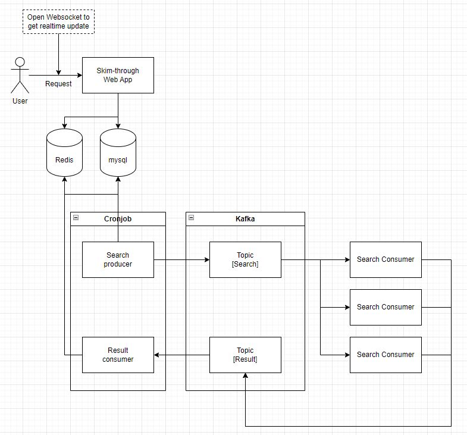

# skim-through
Skimming through prices service over multiple super markets


## Framework / Web service
- django: Easy to build full package, ORM is powerful, experience
Even if I'm familiar with `React`, I decided to use `django`. Otherwise, I need to work with two different setup for each `FE` and `BE`.

- will have to have a `lb` using `nginx` and `two web app. server` under the `lb`


## DB
- No need to search some result fast, no need to get tremendous data from the db. `mysql` might be enough?
- User's preference and configuration? 

## Cache
- Redis to cache search result in per day or half of a day, am guessing items in each of market will not be changed in a day.


## CDN
- No need to have this, contents can be retrieved from the original source

## distributed system
- `Apache Kafka` will be used to distribute search
- need to check `DAU` and `QPS` to decide number of `consumer` instances
- `producer` might be separated `cronjob` or `web app server`, django.

## Orchestration tool
- `k8s`

## Shared mem
- do I need to keep session per user? yes, to track each user's request
- Should I save this? then will store this in `mysql`

## User login
- google, apple, github will be available just for the reference

## Dependency management
`poetry`

### Install

Linux
```
curl -sSL https://install.python-poetry.org | python3 -
```


Windows (Add `C:\Users\user-name\AppData\Roaming\Python\Scripts` in your PATH )
```
(Invoke-WebRequest -Uri https://install.python-poetry.org -UseBasicParsing).Content | py -
```

### Project setup

#### Init

```
poetry init
```

#### Adding dependencies

```
poetry add Django djangorestframework mysqlclient
```

#### start venv
```
poetry shell
```

### Running cmd over the poetry
```
poetry run python manage.py runserver
```

### Updating version minor

```
poetry version minor
```


#### DB - mysql
```
use skim_through;
create user skim_through@'%' identified by xxx;
grant all privileges on *.* to skim_through@'%';
flush privileges;
```


#### Kafka

##### Create topic

```
kafka-topics.sh --create --topic search --bootstrap-server localhost:9092 --replication-factor 1 --partitions 1
```

##### Check topic
```
kafka-topics.sh --describe --topic search --bootstrap-server kafka:9092

cd /opt/kafka_2.13-2.8.1/bin/
```


##### Execute consumer
```
./kafka-console-consumer.sh --topic search --bootstrap-server kafka:9092
```


##### Execute producer
```
./kafka-console-producer.sh --topic search --broker-list kafka:9092
```


###### initial architecture
